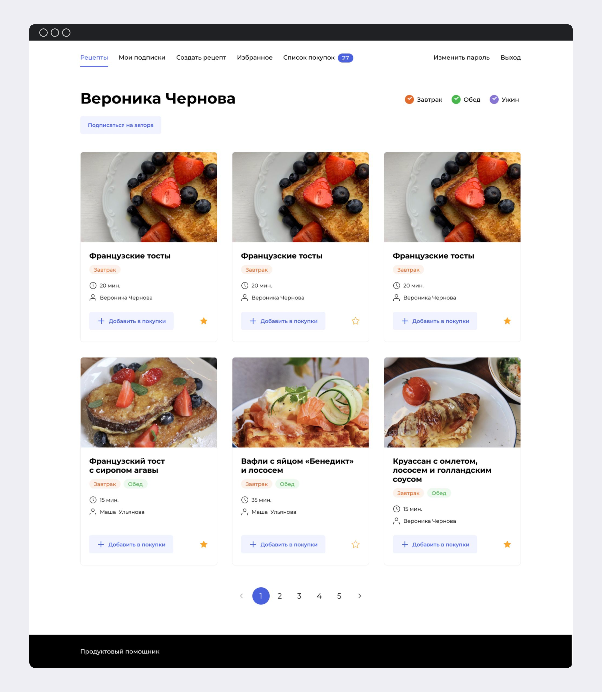
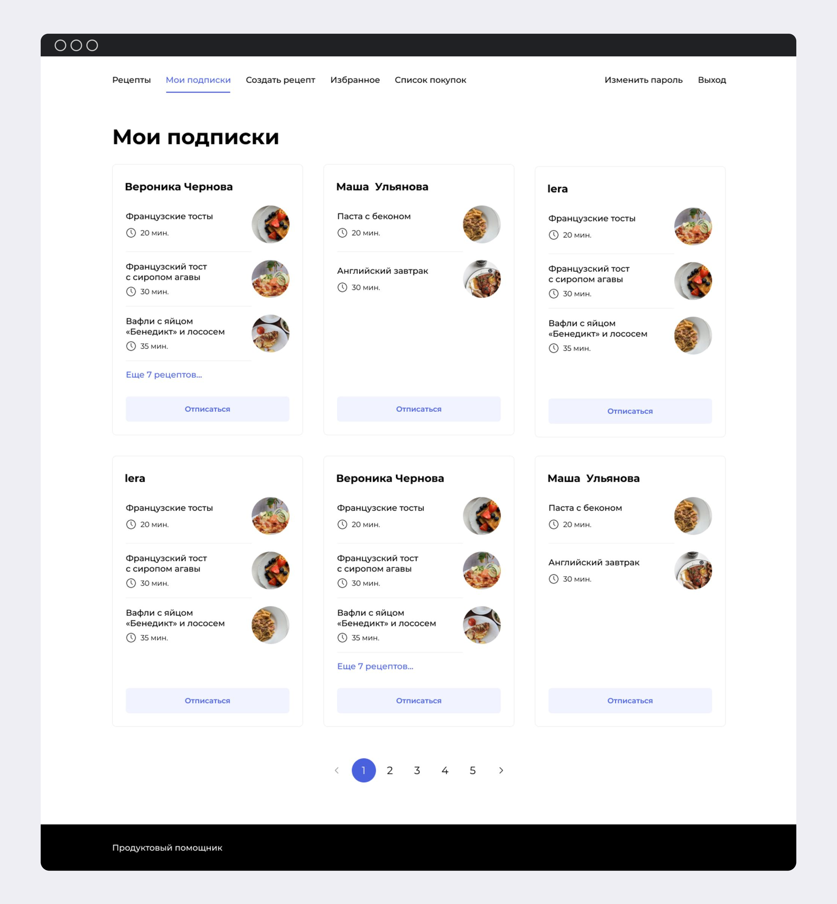
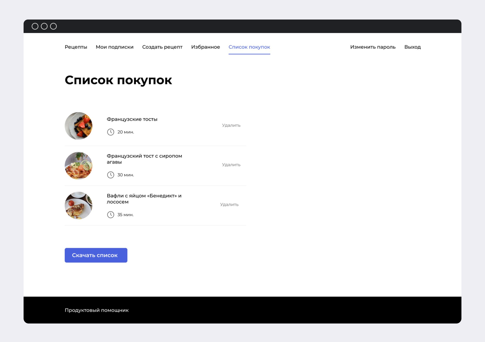

# Foodio


A social network for sharing recipes, with the ability to download a list of ingredients for selected ones. After adding recipes into cart, user can download list with required ingredients. Detailed documentation for the project and requests examples are available at
```
http://130.193.41.215/api/docs/
```
### *Description*
A social network for sharing recipes, with the ability to download a list of ingredients for selected ones.
### *This projects allows you:*
- Create recipes.
- Add other user's recipes to favorites.
- Download a list of ingredients for selected recipes.
### *Technologies*
- [Python 3.7](https://www.python.org/downloads/release/python-370/)
- [django rest framework 3.12.4](https://www.django-rest-framework.org)
- [djoser 2.1.0](https://djoser.readthedocs.io/en/latest/getting_started.html)
- [PostgreSQL](https://www.postgresql.org)
- [Docker 20.10.23](https://www.docker.com)
  
###### *The rest of the technologies can be found in the requirements.txt file*

## At a glance
User's page                     |  Subscription page                  | Ingredients list
:-----------------------------:|:-----------------------------:|:-----------------------------:
 |  | 

### *How to launch a project on remote server*
clone the repository locally.
```
git@github.com:SemenovaLiza/foodgram-project-react.git
```
Alternately execute commands on the server to install Docker and Docker Compose for Linux.
```
sudo apt update
sudo apt install curl
curl -fSL https://get.docker.com -o get-docker.sh
sudo sh ./get-docker.sh
sudo apt-get install docker-compose-plugin
```
Create an .env file in foodgram-project-react/infra/ directory and fill it with the data as shown below.
```
touch foodgram-project-react/infra/.env
POSTGRES_USER=username
POSTGRES_PASSWORD=password
POSTGRES_DB=db_for_postgres
DB_HOST=db
DB_PORT=5432
```
Run docker compose:
```
sudo docker compose up -d --build
```
Make migrations, create superuser if necessary and collect static to static_backend volume.
```
sudo docker compose exec backend python manage.py makemigrations
sudo docker compose exec backend python manage.py migrate
sudo docker compose exec backend python manage.py load_data
sudo docker compose exec backend python manage.py createsuperuser
sudo docker compose exec backend python manage.py collectstatic
```
This project is available at:
```
http://130.193.41.215/recipes
```

**Admin credentials:**
```
login: youremail@domain
password: yourpassword
```

### *Author*
Elizaveta Semenova
